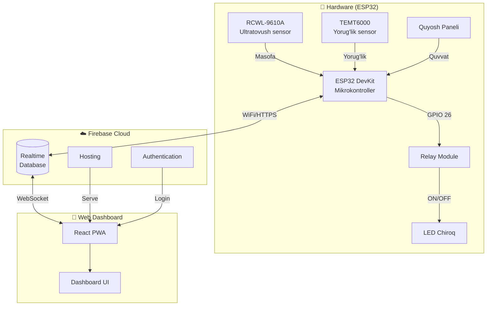
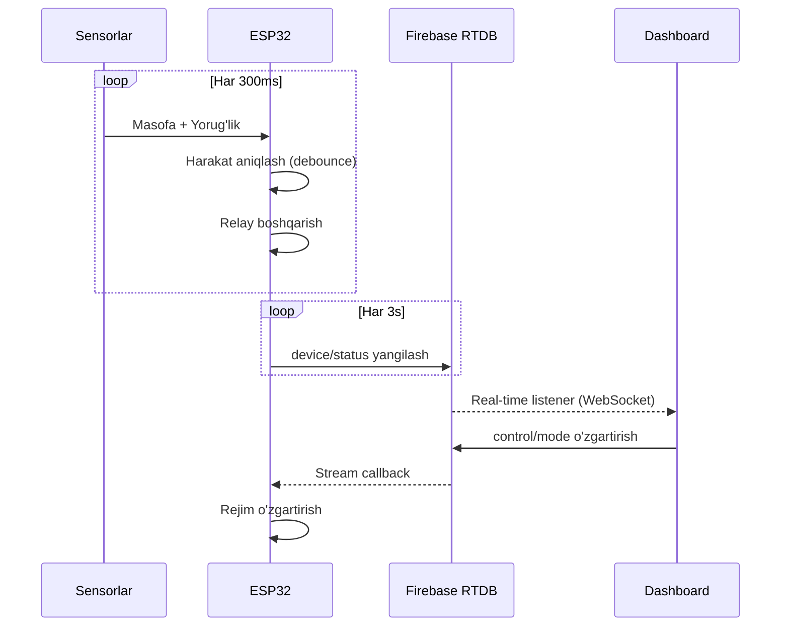
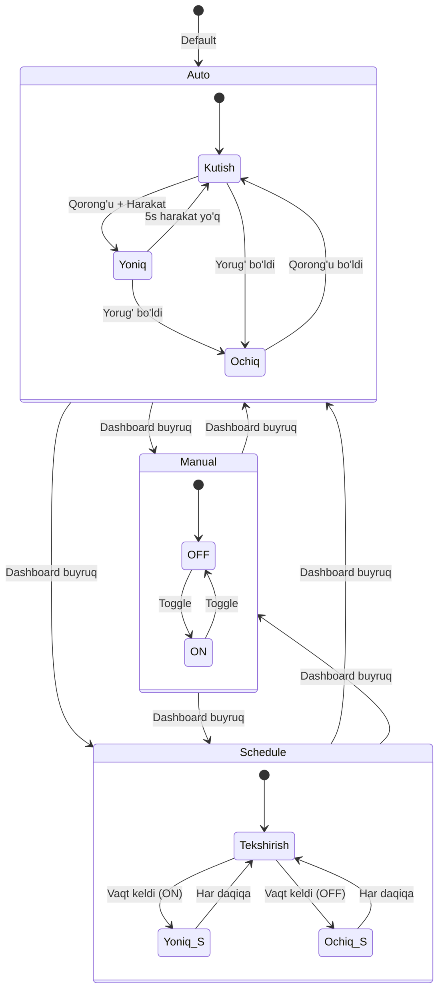
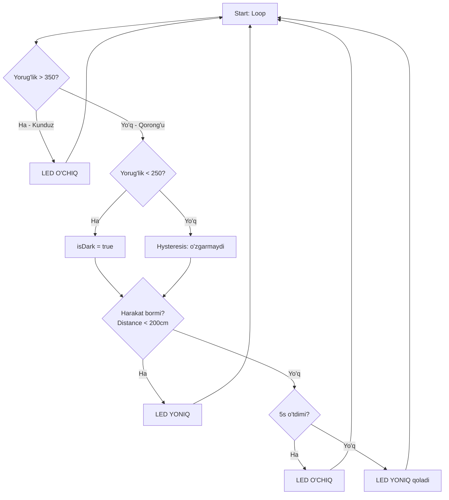
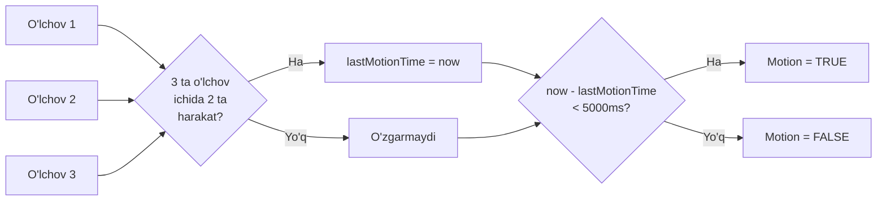
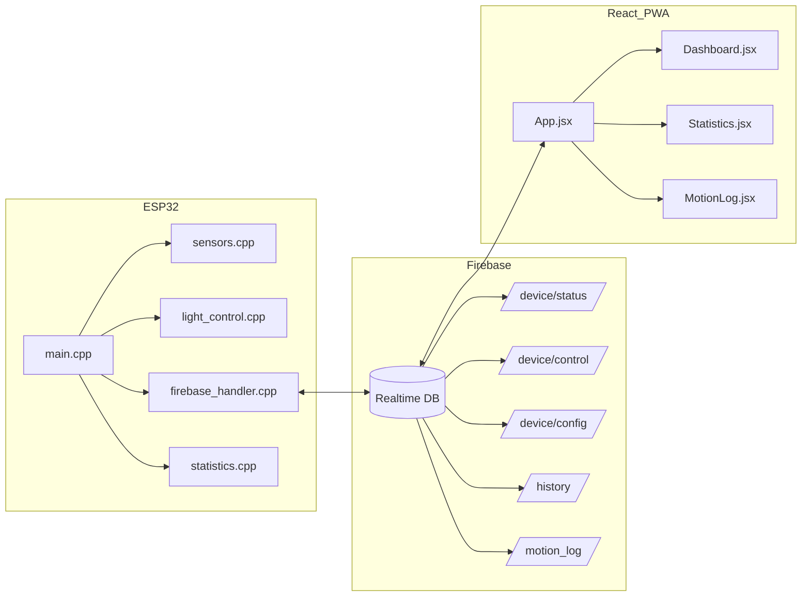
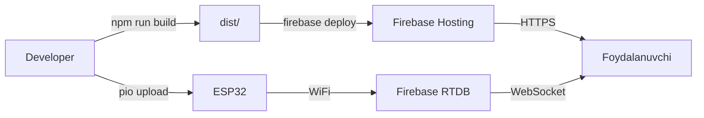

# Tizim Arxitekturasi

## Umumiy arxitektura

## Ma'lumot oqimi

## Rejimlar diagrammasi

## Auto rejim flowchart

## Sensor debounce logikasi

## Tizim komponentlari

## Deploy arxitekturasi

