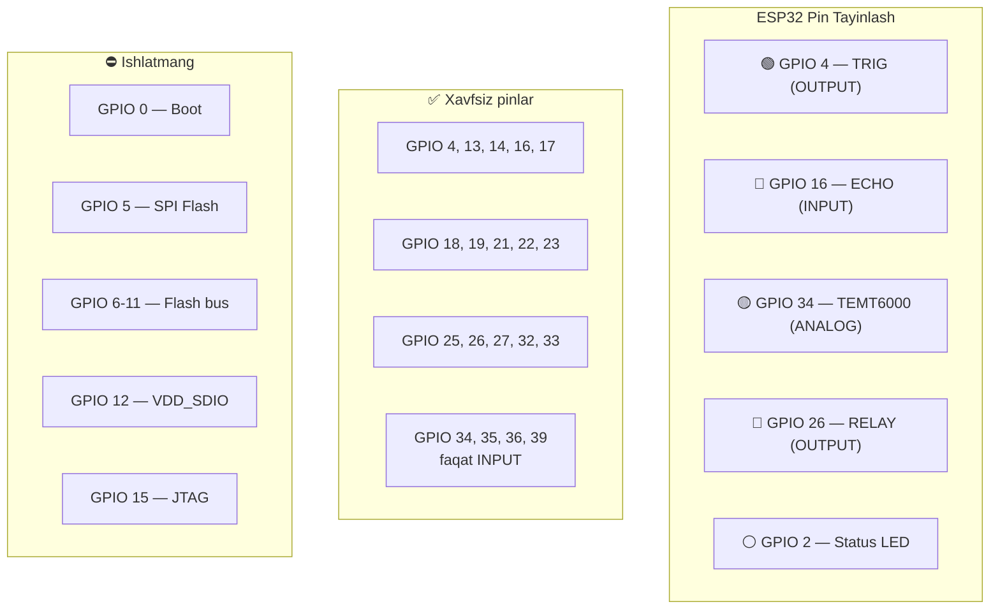
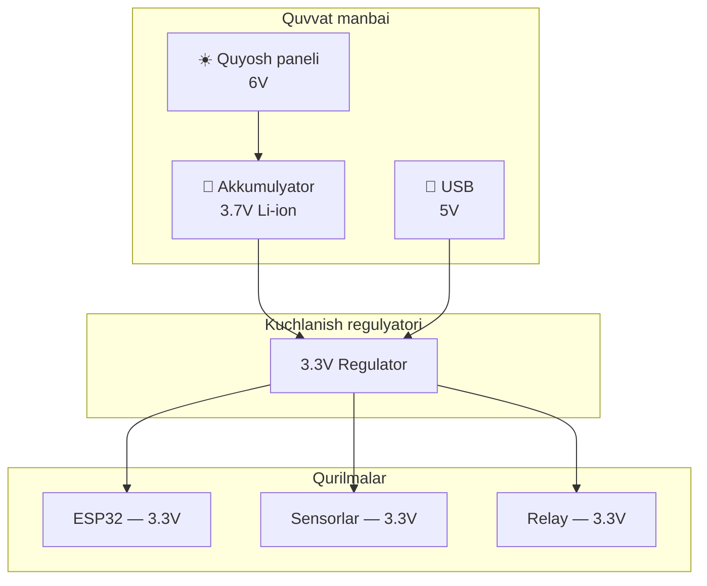
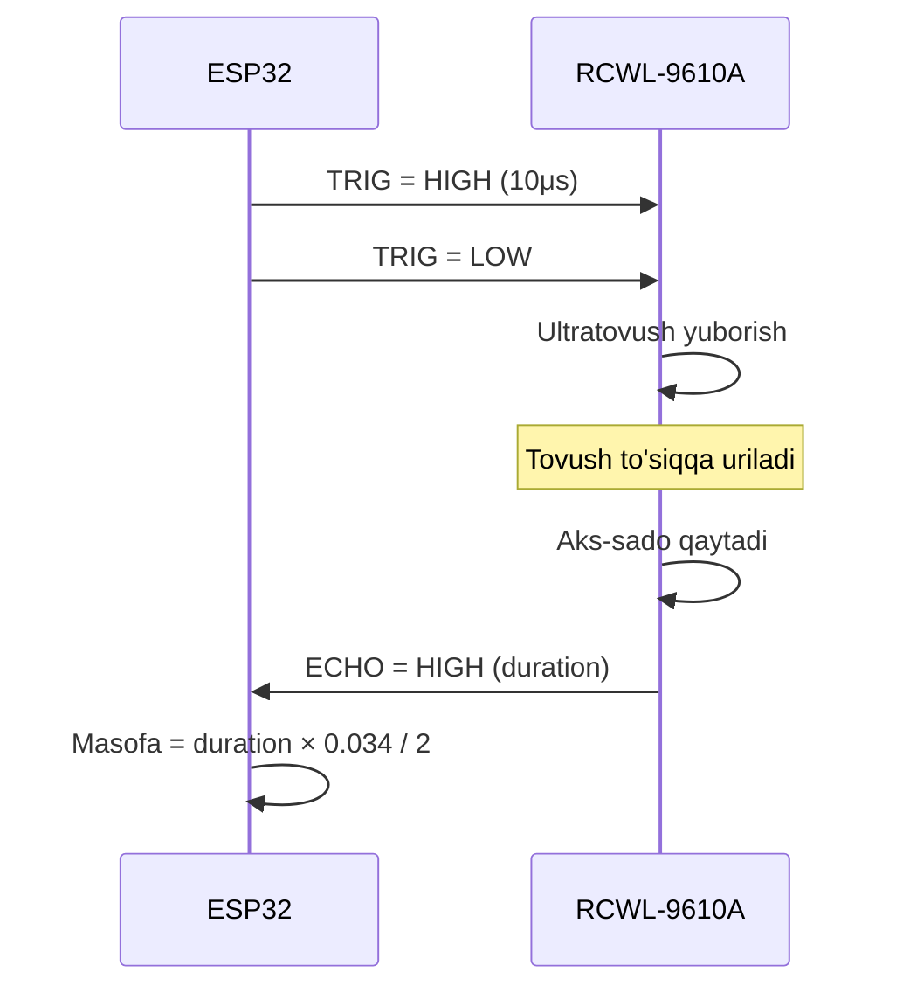

# Hardware - Ulash sxemasi

## Komponentlar ro'yxati

| # | Komponent | Model | Soni | Vazifasi |
|---|-----------|-------|------|----------|
| 1 | Mikrokontroller | ESP32 DevKit 38-pin | 1 | Asosiy boshqaruv |
| 2 | Ultratovush sensor | RCWL-9610A (3.3V) | 1 | Masofa o'lchash |
| 3 | Yorug'lik sensor | TEMT6000 | 1 | Kunduz/tun aniqlash |
| 4 | Relay modul | 3.3V 1-kanal | 1 | LED yoqish/o'chirish |
| 5 | LED chiroq | 12V yoki 5V | 1 | Ko'cha yoritgichi |
| 6 | Quyosh paneli | Mini 6V | 1 | Energiya manbai (maket) |

## Ulash sxemasi

```
                         ┌───────────────────────┐
                         │      ESP32 DevKit      │
                         │                       │
    ┌──────────┐         │  3.3V ●───────────┐   │         ┌──────────┐
    │RCWL-9610A│         │                   │   │         │  RELAY   │
    │          │         │  GND  ●───────┐   │   │         │  MODULE  │
    │ VCC ─────┼─────────┼───────────────┼───┘   │         │          │
    │ GND ─────┼─────────┼───────────────┘       │         │ VCC ─────┼── 3.3V
    │ TRIG ────┼─────────┼── GPIO 4              │         │ GND ─────┼── GND
    │ ECHO ────┼─────────┼── GPIO 16             │         │ IN ──────┼── GPIO 26
    └──────────┘         │                       │         │          │
                         │                       │         │ COM ─────┼──┐
    ┌──────────┐         │                       │         │ NO ──────┼──┼──┐
    │ TEMT6000 │         │                       │         └──────────┘  │  │
    │          │         │                       │                       │  │
    │ VCC ─────┼─────────┼── 3.3V                │         ┌──────────┐  │  │
    │ GND ─────┼─────────┼── GND                 │         │ 💡 LED   │  │  │
    │ OUT ─────┼─────────┼── GPIO 34 (ADC)       │         │  CHIROQ  │  │  │
    └──────────┘         │                       │         │          │  │  │
                         │  GPIO 2 ● (Status LED)│         │ (+) ─────┼──┘  │
                         │                       │         │ (-) ─────┼─────┘
    ┌──────────┐         │                       │         └──────────┘
    │☀️ SOLAR  │         │  VIN/USB ● (Quvvat)   │
    │  PANEL   ├─────────┼── 5V                  │
    └──────────┘         └───────────────────────┘
```

## Signal yo'nalishlari

```
    ESP32                    Komponent           Yo'nalish
    ─────                    ─────────           ─────────
    GPIO 4  ──────────────►  RCWL TRIG           OUTPUT (10μs pulse)
    GPIO 16 ◄──────────────  RCWL ECHO           INPUT  (duration)
    GPIO 34 ◄──────────────  TEMT6000 OUT        ANALOG INPUT (0-4095)
    GPIO 26 ──────────────►  RELAY IN            OUTPUT (HIGH/LOW)
    GPIO 2  ──────────────►  Onboard LED         OUTPUT (status)
```

## Pin konfiguratsiya diagrammasi



## Quvvat ta'minoti sxemasi



## Sensor ishlash prinsipi



## Muhim eslatmalar

> ⚠️ **RCWL-9610A** 3.3V da ishlaydi — to'g'ridan-to'g'ri ESP32 ga ulash mumkin
>
> ⚠️ **Relay** 3.3V logic bilan ishlashi kerak (5V relay ishlamaydi)
>
> ⚠️ **GPIO 34** faqat input — analog o'qish uchun ideal
>
> ⚠️ **Kod yuklash paytida** barcha simlarni ajrating
>
> ⚠️ **GPIO 5, 6-11, 12, 15** ishlatmang — strapping/flash pinlar
